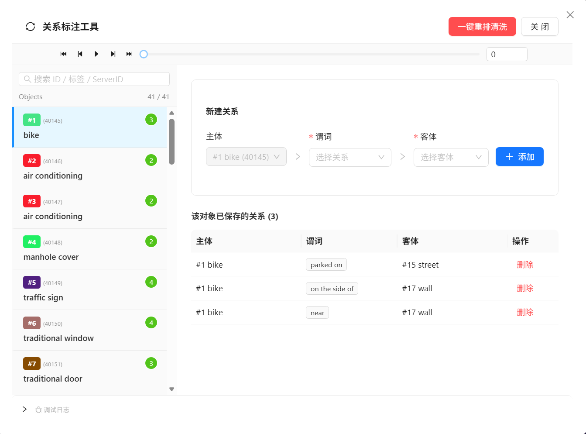
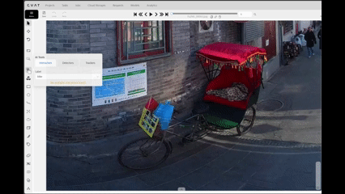

<div align="center">
  

  <h1>🔗 CVAT 关系标注工具</h1>
  <p>本仓库是基于官方 CVAT 的深度二次开发分支，旨在解决大规模视频标注任务中场景图 (Scene Graph) 与跨帧对象关系标注难题。</p>
  <p>
  <a href="https://github.com/cvat-ai/cvat"></a>
  
  
  <a href="https://opensource.org/licenses/MIT"></a>

  </p>

  🇨🇳 简体中文 | [🇺🇸 English](README.md)
</div>

<br/>

## 📖 概述

官方 [CVAT](https://github.com/cvat-ai/cvat) 提供了完善的目标检测与追踪标注能力，但缺少对**对象间语义关系**（如 `行人 — 骑行 — 自行车`）的跨帧标注支持。

本分支新增了一套 **关系标注工具 (Relation Annotation Tool)**，主要功能包括：

- **关系三元组创建**（主体 → 谓词 → 客体），通过独立的 UI 面板完成。
- **内嵌帧播放器**，采用隔离化设计，在标注模态框 (Modal) 内实现独立帧控制，规避主画布的 CSS 污染与全局 Redux 事件冲突。。
- **一键 Track ID 归一化引擎**，解决原生 `.get()` / `.put()` 标注 API 导致的 ID 碎片化与关键帧覆盖问题。

---

## ✨ 功能说明

### 1. 内嵌帧播放器
基于 Ant Design 组件（`Slider`、`Button`、`InputNumber`）构建的轻量级播放器，渲染在关系标注弹窗内部，与主界面播放器无 CSS 和事件耦合。\
<div align="center">
  
</div>

| 快捷键 | 功能描述 | 技术实现 |
| :--- | :--- | :--- |
| <kbd>D</kbd> / <kbd>F</kbd> | 上一帧 / 下一帧 | 调用底层 Frame Controller API<br><br> |
| <kbd>C</kbd> / <kbd>V</kbd> | 快进/快退 (±10) | 步进式渲染优化<br><br> |
| <kbd>Space</kbd> | 状态切换 | 拦截全局 Redux 快捷键，防止主屏误触<br><br> |

### 2. Track ID 归一化（一键重排清洗）
在长时间标注过程中，反复的合并/拆分操作可能导致 Track ID 不连续或产生冲突。"一键重排清洗"功能的处理流程如下：

1. 通过 `annotations.export()` 导出全部标注数据（保留完整关键帧信息）。
2. 在内存中将所有 ID 重新映射为连续序列。
3. 调用 `annotations.clear()` 清除现有标注，再通过 `annotations.import()` 导入归一化后的数据集。
4. 通过 `annotations.save()` 将结果持久化至服务器。

该方案避免了将标注文件重新导入后可能出现的ID错乱问题。

### 3. 队列式批量生成
支持将多条关系三元组加入队列后统一提交。每条生成的关系以 `TRACK` 类型、`POINTS` 形状存储，定位于主体包围框中心。当主体或客体从画面中消失时，该 Track 自动终止（设置 `outside = true`）。

### 4. 技术架构层级 (Architecture)
*(此处预留：后续可补充架构简图，说明 `Relation Dialog` 如何挂载至 CVAT `StandardWorkspace` 原生 React 组件树，以及 Redux 状态拦截机制)*
- **UI 注入点**: 在 `cvat-ui/src/containers/annotation-page/standard-workspace/controls-side-bar` 中注册自定义操作按钮。
- **UI 组件重构解耦**: 将原本庞大的 `relation-dialog` 彻底模块化为独立的可复用组件 (`PlayerControls`, `ObjectList`, `RelationForm`)，并抽离了自定义 Hooks (`useAnnotations`, `useKeyboardShortcuts`, `useWipeAndSync`) 以提升代码可维护性。
- **算法规范化**: 核心数学算法（如 `PositionManager` 与优先级排版）已严格按照 JSDoc 英文文档规范重写，并通过完备的 Jest 单元测试。
- **状态管理**: 维持独立组件 State，避免污染 CVAT 全局 Redux Store，仅在触发“一键重排清洗 (Wipe & Sync)”时向核心 API 发起事务性请求。
- **后端脚本解耦**: 将 Python 执行环境（如 `download_nuctl.py`、`processor.py`）重构为基于 `argparse` 的标准 CLI 脚本，去除了所有硬编码的依赖路径，强制落实 Pylint 代码规范，并补齐了逻辑单元测试。

---

## ⚙️ 前提条件：CVAT 项目标签配置

本工具要求项目中存在一个名为 `Relation` 的标签，且包含三个指定属性。请在创建 Project 或 Task 时，通过 **Raw** JSON 编辑器添加以下配置：

```json
[
  {
    "name": "Relation",
    "color": "#ff0000",
    "attributes": [
      {
        "name": "predicate",
        "mutable": true,
        "input_type": "select",
        "default_value": "near",
        "values": ["near", "holding", "riding", "wearing", "next_to", "behind"]
      },
      { "name": "subject_id", "mutable": true, "input_type": "text", "default_value": "", "values": [] },
      { "name": "object_id", "mutable": true, "input_type": "text", "default_value": "", "values": [] }
    ]
  }
]
```

> **说明：** `predicate.values` 数组定义了 UI 下拉菜单中可选的关系类型。请根据实际标注需求修改此列表。

---

## 🚀 使用流程
<div align="center">
  
</div>

1. 使用 CVAT 标准工具（矩形框、多边形等）标注目标对象（如 `Car`、`Pedestrian`）,TransT 辅助标注部署教程可参考：[TransT 自动追踪器部署方案](./serverless/pytorch/dschoerk/transt/nuclio/DEPLOY_TRANST_zh.md)。
2. 点击左侧工具栏中的**关系标注图标**（或按 `R` 键）。
3. 在关系标注弹窗中，从标注列表中选择**主体**和**客体**。
4. 从下拉菜单中选择**谓词**。
5. 点击**插入**，将三元组添加到生成队列。
6. 点击**生成**，创建关系 Track。


---

## 🛠 安装方式

> **⚠️ 版本兼容性提醒：** 本扩展插件基于 **CVAT v2.56.2** 版本体系开发。

### 方案 A：Docker 全栈启动（推荐）

最简单的方式，含自定义 UI 和关系标注工具，开箱即用。

**前提条件：** 已安装并运行 [Docker Desktop](https://www.docker.com/products/docker-desktop/)。

```bash
# 1. 克隆本仓库
git clone -b relation-auto-tool https://github.com/QXqin/cvat.git
cd cvat

# 2. 构建镜像并启动所有服务
docker compose up --build -d
```

> **首次构建：** 需下载依赖并编译自定义 UI，预计耗时 15–30 分钟。  
> **后续启动：** 直接 `docker compose up -d`（无代码改动无需 `--build`）。

**3. 验证启动状态** — 等待所有容器就绪：

```bash
docker compose ps
```

所有服务显示 `running` 或 `healthy` 后，浏览器打开 **http://localhost:8080**。

**4. 创建超级用户**（首次使用）：

```bash
docker exec -it cvat_server python manage.py createsuperuser
```

**5. 配置 `Relation` 标签** — 在项目中添加标签：

1. 登录 → **Projects** → **Create new project**
2. 切换到 **Labels** 选项卡，点击 **Raw**（JSON 编辑器）
3. 粘贴上方 [标签配置](#️-前提条件cvat-项目标签配置) 章节中的 JSON
4. 保存项目

**6. 在项目下创建 Task**，上传视频/图片，然后点击 **Open** 进入标注编辑器。

**7. 验证关系标注工具** — 左侧工具栏中应出现关系标注图标，点击（或按 <kbd>R</kbd>）打开关系对话框。

> 点击 **Generate** 后，使用 <kbd>D</kbd> / <kbd>F</kbd> 逐帧浏览，验证关系 Track 是否正确生成。

---

### 方案 B：仅构建前端

> 适用于已有 CVAT v2.56.2 后端实例的场景，仅替换 UI 包。

```bash
git clone -b relation-auto-tool https://github.com/QXqin/cvat.git
cd cvat/cvat-ui
yarn install
yarn run build
# 将 dist/ 目录部署到你的 CVAT nginx 静态文件路径
```

### 方案 C：以补丁形式应用到已有源码

> 适用于已维护 CVAT fork 的团队，按需集成此功能。

```bash
# 在你现有的 CVAT 源码根目录下执行
git apply cvat-relation-annotation-tool.patch
cd cvat-ui
yarn run build
```

---

## ⚖️ 许可与声明

本项目是 [cvat-ai/cvat](https://github.com/cvat-ai/cvat) 的派生分支，依照 **[MIT 协议](https://opensource.org/licenses/MIT)** 发布。

关联教程： [TransT 自动追踪器部署方案](./serverless/pytorch/dschoerk/transt/nuclio/DEPLOY_TRANST_zh.md)

原始 CVAT 的所有版权声明均按照协议条款予以保留。

## 🛠 开发说明
本项目核心逻辑及文档由开发者主导，部分代码与架构优化采用 **Gemini / Claude** 等大型语言模型 (LLM) 辅助完成，旨在提升开发效率与代码健壮性。
